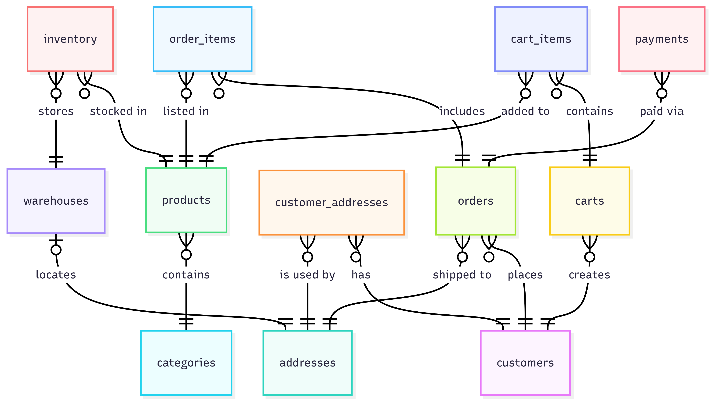

# Design Document

By Bartłomiej Adamiec

Video overview: <[URL HERE](https://youtu.be/iZbey_y7Qc8)>

## Scope

### Purpose
The database serves as the core of an e-commerce platform. It is designed to manage the entire lifecycle of online product sales, ensuring data integrity and the operational efficiency of the online store.

### Included physical and logical entities:
* **Customers:** Users who browse the catalog and place orders.
* **Warehouses:** Physical locations where product inventory is stored.
* **Products & Categories:** A catalog of goods available for sale, along with their descriptions and categorization.
* **Addresses:** A centralized address system for both customers and warehouses.
* **Carts & Orders:** Transactional data (shopping sessions and finalized contracts).

### The database does not store:
* **Sensitive Payment Details:** Raw credit card numbers or CVV codes. It only records the status of payments and the provider used.
* **Employee Data:** Information regarding HR structure, salaries, or staff schedules is not included.
* **Marketing Analytics:** User behavior on the website, such as clickstreams, page views, or ad campaign performance.

## Functional Requirements
The system is designed to support two main roles: Customers and Administrators.

**Customers can:**
* Create accounts and manage their personal data and address book (shipping/billing).
* Browse products by category and search for items by name.
* Add products to the cart, modify quantity, or remove items before purchase.
* Place orders (convert cart to order) and pay for them.
* Check order history and current status (e.g., "Shipped").

**Administrators can:**
* Manage the product catalog: add new items, update descriptions, change prices, and assign categories.
* Monitor stock levels across various locations (warehouses).
* Handle order fulfillment: change order and payment statuses.
* Use analytical views (e.g., `logistics`) to generate picking lists for warehouse staff or resolve customer issues.

### What's beyond the scope of what a user should be able to do with your database?
In my opinion, the database can be extended in the future to include the following functionalities:
* **Reviews & Ratings:** Ability to add customer reviews on exact products and add an overall rating on a scale of 1 to 10.
* **Multi-currency Support:** All prices are currently stored in a single currency; there is no dynamic exchange rate conversion mechanism.
* **Advanced Returns (RMA):** While an order can have a 'Cancelled' status, there is no dedicated system for handling partial returns or warranty claims.

## Representation

### Entities
The database includes the following entities:

#### `addresses` table:
* `id`, which specifies the unique ID for the address as an `INTEGER`. This column has the `PRIMARY KEY` constraint applied.

* `country`, which is the full country name in English, set as `TEXT`. The `DEFAULT` value is set to 'Poland'.

* `city`, which is the full city name in English, set as `TEXT`.

* `zip_code`, which is set as `TEXT` because different countries have different zip code styles.

* `street`, which is the full street name including the building number, set as `TEXT`.

* `apartment`, which is the apartment number, set as `TEXT` because some buildings have alphabetical suffixes.

Not all columns in this table have the `NOT NULL` constraint because not every address requires an apartment number (e.g., detached houses).

#### `categories` table:
* `id`, which specifies the unique ID for the category as an `INTEGER`. This column has the `PRIMARY KEY` constraint applied.

* `name`, which is the name of the product category, set as `TEXT`. This column has the `UNIQUE` constraint applied.

* `description`, which provides details about the category content, set as `TEXT`.

All columns in this table have the `NOT NULL` constraint applied. Descriptions are valuable for proper product categorization.

#### `products` table:
* `id`, which specifies the unique ID for the product as an `INTEGER`. This column has the `PRIMARY KEY` constraint applied.

* `name`, which is the marketing name of the product, set as `TEXT` with a `UNIQUE` constraint applied to avoid redundancy.

* `description`, which contains detailed product features, set as `TEXT`.

* `price`, which represents the current cost of the product. It is set as `DECIMAL(10, 2)` to ensure financial precision.

* `category_id`, which is a `FOREIGN KEY` referencing the `categories` table.

The `description` and `category_id` columns do not have the `NOT NULL` constraint. This allows for new products that might not fit into existing categories immediately or whose descriptions can be added later (optional).

#### `warehouses` table:
* `id`, which specifies the unique ID for the warehouse as an `INTEGER`. This column has the `PRIMARY KEY` constraint applied.

* `name`, which is the internal name or code of the warehouse, set as `TEXT`. This is treated optionally.

* `address_id`, which is a `FOREIGN KEY` referencing the `addresses` table, specifying the physical location. It has the `NOT NULL` constraint applied as we must know the exact location.

#### `inventory` table:
* `product_id`, which is a `FOREIGN KEY` referencing the `products` table.

* `warehouse_id`, which is a `FOREIGN KEY` referencing the `warehouses` table.

* `stock_level`, which indicates the quantity of the product stored at a specific warehouse. It is set as `INTEGER` with a `DEFAULT` of 0 and a `CHECK` constraint ensuring non-negative values.

The combination of `product_id` and `warehouse_id` forms a composite `PRIMARY KEY` to ensure a unique record for each product-warehouse pair.

#### `customers` table:
* `id`, which specifies the unique ID for the customer as an `INTEGER`. This column has the `PRIMARY KEY` constraint applied.

* `first_name`, which is the customer's first name, set as `TEXT`.

* `last_name`, which is the customer's surname, set as `TEXT`.

* `email`, which is the user's email address used for login. It is set as `TEXT` and has a `UNIQUE` constraint.

* `password`, which stores the hashed password for security, set as `TEXT`.

* `phone_number`, which is the contact number with the country prefix, set as `TEXT`.

* `birth_date`, which is the date of birth, set as `DATE`.

Only `birth_date` in this table is optional. All other columns have the `NOT NULL` constraint applied.

#### `customer_addresses` table:
* `customer_id`, which is a `FOREIGN KEY` referencing the `customers` table.

* `address_id`, which is a `FOREIGN KEY` referencing the `addresses` table.

* `address_type`, which specifies the role of the address. It is set as `TEXT` with a `CHECK` constraint allowing only 'BILLING' or 'SHIPPING'.

The combination of `customer_id` and `address_id` forms a composite `PRIMARY KEY`. All columns have the `NOT NULL` constraint applied.

#### `carts` table:
* `id`, which specifies the unique ID for the cart as an `INTEGER`. This column has the `PRIMARY KEY` constraint applied.

* `customer_id`, which is a `FOREIGN KEY` referencing the `customers` table with the `NOT NULL` constraint applied.

* `created_at`, which stores the timestamp of cart creation, set as `DATETIME` with a `DEFAULT` value of the current time.

#### `cart_items` table:
* `id`, which specifies the unique ID for the cart line item as an `INTEGER`. This column has the `PRIMARY KEY` constraint applied.

* `cart_id`, which is a `FOREIGN KEY` referencing the `carts` table.

* `product_id`, which is a `FOREIGN KEY` referencing the `products` table.

* `quantity`, which represents the number of units in the cart. It is set as `INTEGER` with a `CHECK` constraint ensuring the value is greater than 0.

All columns have the `NOT NULL` constraint applied.

#### `orders` table:
* `id`, which specifies the unique ID for the order as an `INTEGER`. This column has the `PRIMARY KEY` constraint applied.

* `customer_id`, which is a `FOREIGN KEY` referencing the `customers` table.

* `shipping_address_id`, which is a `FOREIGN KEY` referencing the `addresses` table.

* `total_amount`, which is the final sum to be paid, set as `DECIMAL(10, 2)`.

* `status`, which tracks the order progress. It is set as `TEXT` with a `CHECK` constraint limiting it to predefined states ('received', 'unpaid', 'paid', 'shipped', 'delivered', 'cancelled').

* `created_at`, which records when the order was placed, set as `DATETIME` with a `DEFAULT` of the current time.

`created_at` has a `DEFAULT` value, so there is no need to apply the `NOT NULL` constraint explicitly. Other columns have the `NOT NULL` constraint applied.

#### `order_items` table:
* `id`, which specifies the unique ID for the order line item as an `INTEGER`. This column has the `PRIMARY KEY` constraint applied.

* `order_id`, which is a `FOREIGN KEY` referencing the `orders` table.

* `product_id`, which is a `FOREIGN KEY` referencing the `products` table.

* `quantity`, which represents the number of units purchased, set as `INTEGER`.

* `unit_price_snapshot`, which records the price of the product at the moment of purchase. It is set as `DECIMAL(10, 2)` to preserve historical data accuracy.

All columns have the `NOT NULL` constraint applied.

#### `payments` table:
* `id`, which specifies the unique ID for the transaction as an `INTEGER`. This column has the `PRIMARY KEY` constraint applied.

* `order_id`, which is a `FOREIGN KEY` referencing the `orders` table.

* `amount`, which is the transaction value, set as `DECIMAL(10, 2)`.

* `status`, which tracks the transaction state ('pending', 'completed', 'failed'), set as `TEXT` with a `CHECK` constraint.

* `provider`, which indicates the payment processor ('payu', 'p24', 'tpay', 'autopay', 'stripe', 'blik', 'transfer'), set as `TEXT` with a `CHECK` constraint.

All columns have the `NOT NULL` constraint applied.

### Relationships

The below entity relationship diagram describes the relationships among the entities in the e-commerce database.

As detailed by the diagram:

#### `addresses`:
* An order can have only one address to be shipped but many orders can be made to one address. Many customers can order something to one address (e.g., in workplace).
* Warehouse can have only one address but address can't have any warehouse.

#### `warehouses`:
* Warehouses have plenty of products inside and products can be allocated in few warehouses at the same time.

#### `products`:
* Product can belong only to one category but category contains a lot of products.

* One product can be in different quantity in different warehouses. One product can be (depending on quantity) in plenty of carts or orders as cart item or order item.

#### `iventory`:
* This table serves as the bridge for the many-to-many relationship between products and warehouses.

#### `customers`:
* Customers and addresses share a many-to-many relationship, a customer can save multiple locations (home, office), and one address can be associated with multiple users (e.g., family members or co-workers).

* One customer can have plenty of carts and orders but one order (or cart) belongs to only one customer.

#### `orders` & `payments`:
* One order can have plenty of payments (failed status) but payment can be referenced with only one order.

## Optimizations
In database :
#### Views:
`logistics`:
* It eliminates the need for logistics staff to understand the complex underlying table relationships, providing exactly what is needed for shipping and inventory management.

`customer_service`
* It allows support staff to verify orders using names and emails, but it hides sensitive columns like password (hashed) and birth_date. This minimizes the risk of internal data leaks or accidental exposure of PII (Personally Identifiable Information).

#### Indexes:
`search_customers`: Quick searching customers. Specially valiuable in on-phone customer service.

`search_orders`: Allowing support staff to provide real-time order status updates to customers.

`search_product_name`: Optimizes the storefront search engine, ensuring customers receive immediate results when browsing the catalog.

`search_inventory_product`: Accelerates stock availability checks for both the website display and internal logistics management.

## Limitations

#### Returns and Refunds

The current architecture does not include a system for Returns (RMA). There is no dedicated table to track returned items, reason for return, or the condition of the stock being sent back to the warehouse.

#### Product Variants

The design does not support Product Variants (e.g., phones with different storage) as a single entity. Each variant must be created as a completely separate product, which may lead to data redundancy.
